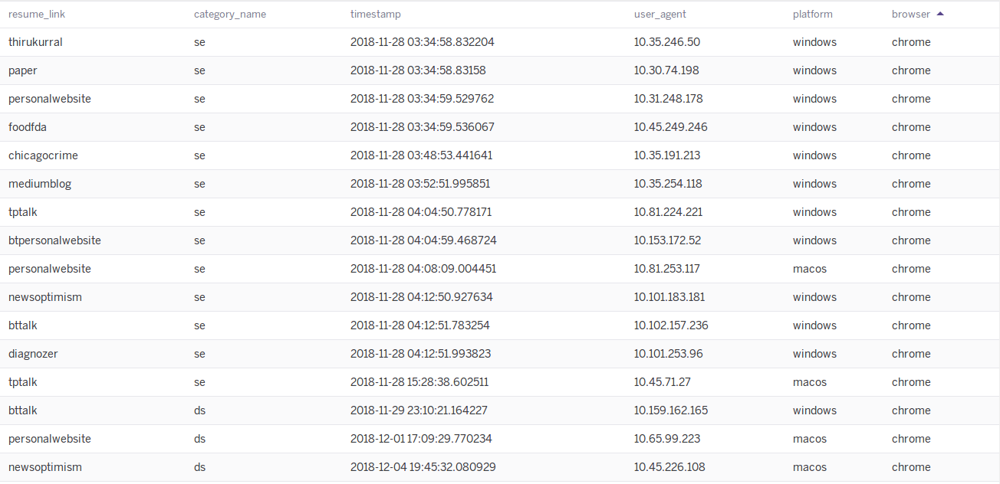
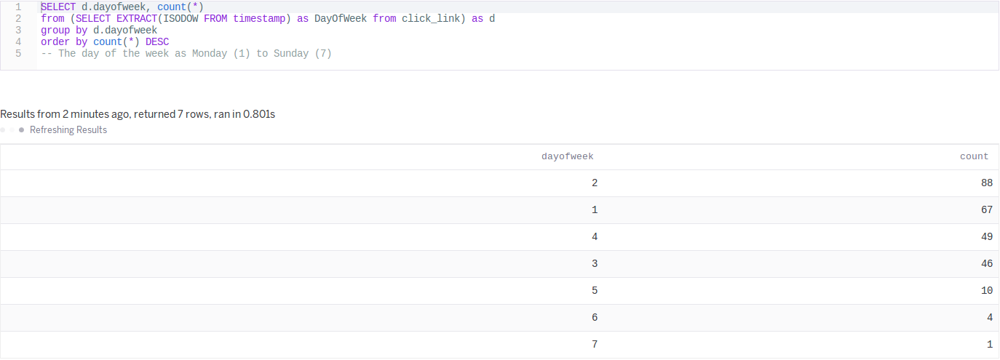

# ResumeTracker
A minimalistic app that helps job seekers to identify their target recruiters.
This is a free app where you can create your hyperlink and build your analytics to analyze your target audience.

## Implementation Idea:
Identifying your **customer audience** based on the **usage metric** of your **product**.

1. Customer audience - Recruiters/Hiring Managers
2. usage metric - Click through probability
3. product - resume.pdf

## Requirements:
1. Heroku
2. Postgres
3. Python 3
4. Flask
5. 

## Database Structure:
(example use case for my purpose)

    | app_name.heroku.com/
        |nlp/
            | pydata
            | newsoptimism
            | thirukural
            ..
            ..
            ..
        | da/
            | pydata
            | newsoptimism
            ..
            ..
        | ds/
            ..
            ..

**Click Link Table:**

| Category        | Resume_Link           | Timestamp  |
| ------------- |:-------------:| -----:|
| nlp    | newsoptimism | 2017-09-20 8:59:43 |
| nlp      | newsoptimism     |   2017-09-20 2:00:00 |
| da | pydata      |   2017-10-30 12:00:00 |
        
**Website Link Table:**

| Category        | Resume_Link           |
| ------------- |:-------------:|
| pydata    | https://www.meetup.com/PyDataChi/events/251222062/ |
| newsoptimism     | https://medium.com/@hramachandran/impact-of-linguistic-choice-of-words-in-news-articles-105122d099a5    |

### How does my data look like:

### Which day of the week does my resume get attention?

### Reference Links:
1. 