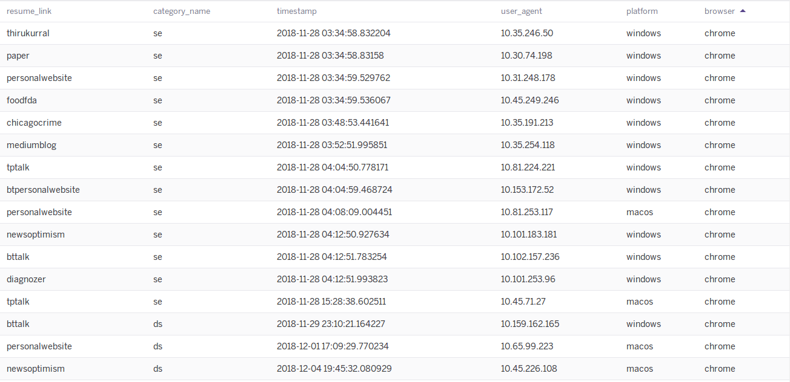
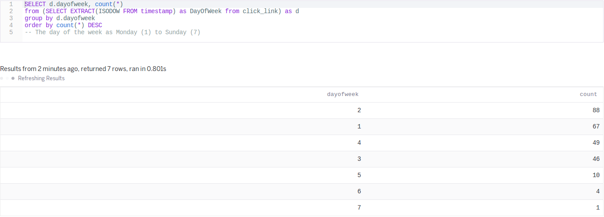
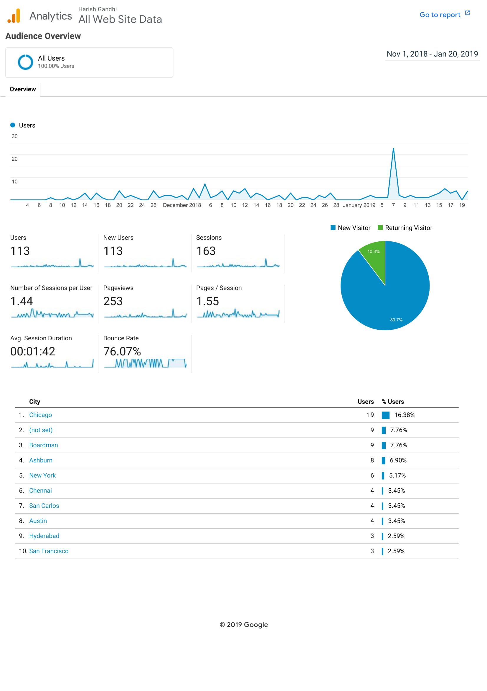

# RecruiterAnalytics
A minimalistic app that helps job seekers to identify their target recruiters.
This is a free app where you can create your hyperlink and build your analytics to analyze your target audience.

# Why this Application?
Why are you not getting that **First** interview call! You might feel that you're qualified for the job based on the job description and skills posted yet you don't get that fair chance of the initial call. 

Why - hard to answer! However, we can increase our chances of getting selected based what concerns the recruiter! Remove the distraction elements in your resume and increase your chance. This application helps in removing the unwanted/rejecting those projects/skills mentioned in your resume for that particular type of recruiter.

Ans: 
		**RecruiterAnalytics** - *A way to analyze your target recruiters(Software Engineering / Data Scientist) behaviour based on where they concentrate on your resume!

## Target Audience
1. Job seekers who apply online through pdf
2. 

PS: Referals are always the best option to get the initial call!

## Implementation Idea:
Identifying your **customer audience** based on the **usage metric** of your **product**.

1. Customer audience - Recruiters/Hiring Managers
2. usage metric - Click through probability
3. product - resume.pdf

## Requirements:
1. Heroku
2. Postgres
3. Python 3
4. Flask
5. 

## Database Structure:
(example use case for my resume)

    | app_name.heroku.com/
        |nlp/
            | pydata
            | newsoptimism
            | thirukural
            ..
            ..
            ..
        | da/
            | pydata
            | newsoptimism
            ..
            ..
        | ds/
            ..
            ..

## Columns

- resume_link: source destination of the hyperlink
- category_name: contains whether the click is from Data Scientist resume or Software Engineer resume
- timestamp: time when the link is clicked
- user_agent: IP address used for getting geographical country location
- platform: what kind of OS are my recruiters using?
- browser: which internet browser are my recruiters using?

### How does my data look like:

### Which day of the week does my resume get attention?

### Anamoly detection on my personal webpage: 23 Unique visitors on Jan 7th

### Reference Links:
1. Data Driven product design: [https://www.youtube.com/watch?v=Y6NI8y21xhg]
2. Multivariate test: [https://www.optimizely.com/optimization-glossary/multivariate-test-vs-ab-test/]

### Why I built this solution:
Recently I got a chance to interview for the TBA position at Indeed and got rejected on the final onsite round. But I learned a lot about what they're doing!

Unfortunately they don't have a solution for job seekers to answer this question: *why my resume is not selected even description and skills matches my profile?*(which btw is a hard question). So I built this analytics application, so that atleast the job seekers know where to concentrate on their resume to get a higher chance for that **1st** step!
